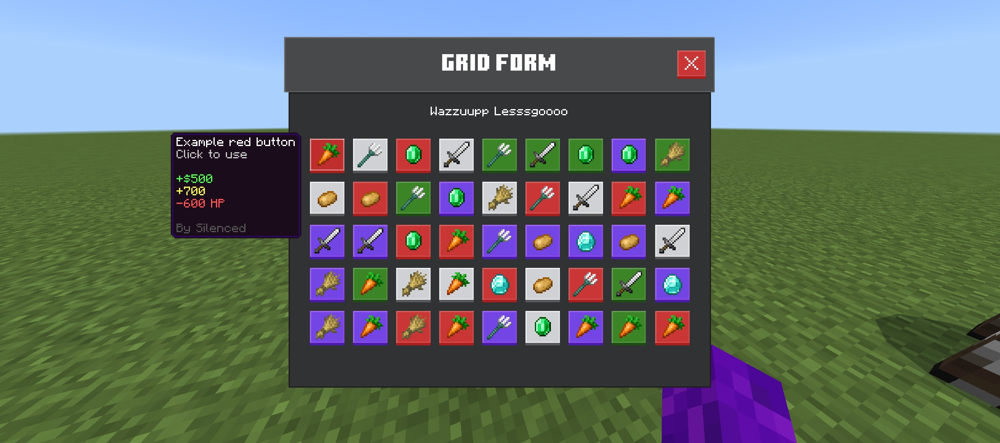

# Grid Action Form v3
Adds a grid layout form template that has a max of 45 buttons (9x5 grid), and each button can have custom background color such as default, red, purple, and green.

## Screenshot

## Usage
- The form title should have the prefix ``§g§r§i§d§r``, this saves the default form template.
- The buttons in default have light background, but if you want to change it to something else, add these prefixes:
  - ``§r§e§d§r`` | color red
  - ``§g§r§e§e§n§r`` | color green
  - ``§p§u§r§p§l§e§r`` | color purple
