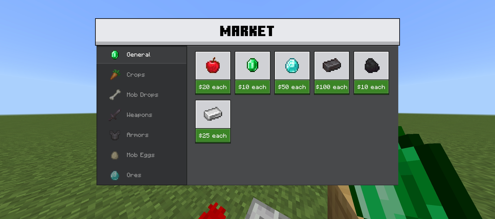

# Market UI
*By SilencedPlay*

**Originally made for Economy SMP Realm**

Provides an organized market ui with categories and grid items to quickly access many features.
It is required to use Market Form Api/Library to make this form to show.

## Features
> **Categories** - Categories are highlighted when it's selected, others will have low opacity. In API, it displays the list of items from the category when clicked.

> **Products** - shop items have bigger icons to preview the item, while the label is under it and has green background.

> **Mixed with Defaut** - It can be mixed with the default form ui by making market form only show if it have the specific title

> **MarketUI Api** - provided a js library to create market form ui faster with organized customization for categories and products.

## Screenshots

